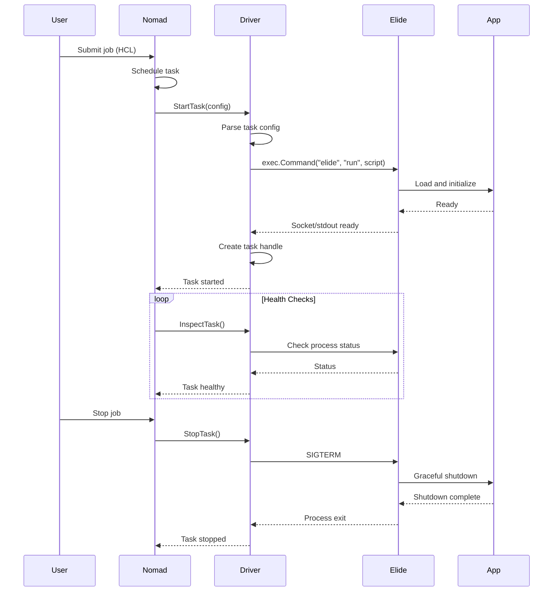

# Elide Task Driver for Nomad

> **A HashiCorp Nomad task driver plugin for orchestrating Elide polyglot runtime instances**

[](https://elide.dev)
[](https://www.nomadproject.io)
[](https://golang.org)
[](https://grpc.io)

---

## Table of Contents

- [Overview](#overview)
- [What is This?](#what-is-this)
- [Architecture](#architecture)
- [Key Features](#key-features)
- [Prerequisites](#prerequisites)
- [Project Structure](#project-structure)
- [Quick Start](#quick-start)
- [Implementation Guide](#implementation-guide)
- [Communication Strategy](#communication-strategy)
- [Testing](#testing)
- [Example Job Specs](#example-job-specs)
- [API Integration](#api-integration)
- [Success Criteria](#success-criteria)
- [Resources](#resources)
- [Contributing](#contributing)

---

## Overview

The **Elide Task Driver** is a custom Nomad plugin written in Go that enables HashiCorp Nomad to orchestrate and manage Elide runtime instances. Instead of running containerized workloads or virtual machines, this driver executes polyglot applications directly on the Elide runtime with native performance and seamless multi-language interoperability.

### What Makes This Special?

1. **Native Performance**: No container overhead - run polyglot apps directly
2. **Multi-Language**: Execute Python, JavaScript, TypeScript, and JVM languages in one process
3. **Built-in AI**: Leverage Elide's local AI inference without external services
4. **Lightweight**: Minimal resource footprint compared to traditional container orchestration
5. **gRPC Integration**: Type-safe communication via Protocol Buffers
6. **Nomad Native**: Full integration with Nomad's scheduling, monitoring, and lifecycle management

---

## What is This?

### The Problem
You want to run Elide applications on a Nomad cluster, but Nomad doesn't natively understand how to execute Elide workloads. You could wrap Elide in containers, but that adds overhead and complexity.

### The Solution
A **task driver plugin** that acts as a bridge:

```
Nomad Scheduler
    ↓ (HCL job specification)
Elide Task Driver (Go)
    ↓ (gRPC/Unix Socket)
Elide Runtime Instance
    ↓ (polyglot execution)
Your Application (Python/JS/etc)
    ↑ (output, logs, metrics)
Back to Nomad
```

### Comparison

| Approach | Overhead | Complexity | Elide Features |
|----------|----------|------------|----------------|
| **Docker + Elide** | High (container runtime) | Medium | All |
| **Raw Exec Driver** | Low | Low | No lifecycle management |
| **Elide Task Driver** | Minimal | Low | All + Nomad integration |

---

## Architecture

### System Components

```
┌─────────────────────────────────────────────────────────────┐
│                    Nomad Control Plane                       │
│  ┌────────────────────────────────────────────────────────┐ │
│  │ Nomad Server (Scheduler)                               │ │
│  │ - Job placement                                        │ │
│  │ - Resource allocation                                  │ │
│  │ - Health monitoring                                    │ │
│  └────────────┬───────────────────────────────────────────┘ │
└───────────────┼─────────────────────────────────────────────┘
                │ Plugin Protocol (gRPC)
                ↓
┌─────────────────────────────────────────────────────────────┐
│                    Nomad Client Node                         │
│  ┌────────────────────────────────────────────────────────┐ │
│  │ Nomad Agent                                            │ │
│  │ ┌──────────────────────────────────────────────────┐   │ │
│  │ │ Plugin Manager                                   │   │ │
│  │ │ - Loads task driver plugins                      │   │ │
│  │ │ - Manages plugin lifecycle                       │   │ │
│  │ └─────────────┬────────────────────────────────────┘   │ │
│  └───────────────┼────────────────────────────────────────┘ │
│                  │ go-plugin (HashiCorp)                    │
│                  ↓                                          │
│  ┌────────────────────────────────────────────────────────┐ │
│  │ Elide Task Driver Plugin (This Project)                │ │
│  │ ┌──────────────────────────────────────────────────┐   │ │
│  │ │ Core Driver Logic                                │   │ │
│  │ │ - TaskConfigSchema()                             │   │ │
│  │ │ - StartTask()                                    │   │ │
│  │ │ - StopTask()                                     │   │ │
│  │ │ - InspectTask()                                  │   │ │
│  │ └──────────────────────────────────────────────────┘   │ │
│  │ ┌──────────────────────────────────────────────────┐   │ │
│  │ │ Task Handle Management                           │   │ │
│  │ │ - Process lifecycle                              │   │ │
│  │ │ - Resource tracking                              │   │ │
│  │ │ - Event publishing                               │   │ │
│  │ └──────────────────────────────────────────────────┘   │ │
│  │ ┌──────────────────────────────────────────────────┐   │ │
│  │ │ Elide API Client (gRPC)                          │   │ │
│  │ │ - Proto-generated stubs                          │   │ │
│  │ │ - Unix socket transport                          │   │ │
│  │ └─────────────┬────────────────────────────────────┘   │ │
│  └───────────────┼────────────────────────────────────────┘ │
│                  │ Unix Socket / Stdio                      │
│                  ↓                                          │
│  ┌────────────────────────────────────────────────────────┐ │
│  │ Elide Runtime Instance (per task)                      │ │
│  │ ┌──────────────────────────────────────────────────┐   │ │
│  │ │ GraalVM Polyglot Engine                          │   │ │
│  │ │ ┌────────────────┐  ┌────────────────┐          │   │ │
│  │ │ │ Python VM      │  │ JavaScript VM  │          │   │ │
│  │ │ └────────────────┘  └────────────────┘          │   │ │
│  │ └──────────────────────────────────────────────────┘   │ │
│  │ ┌──────────────────────────────────────────────────┐   │ │
│  │ │ Elide Intrinsics                                 │   │ │
│  │ │ - Local AI (llama.cpp)                           │   │ │
│  │ │ - HTTP Server                                    │   │ │
│  │ │ - SQLite                                         │   │ │
│  │ └──────────────────────────────────────────────────┘   │ │
│  │ ┌──────────────────────────────────────────────────┐   │ │
│  │ │ User Application Code                            │   │ │
│  │ │ - Python scripts                                 │   │ │
│  │ │ - JavaScript/TypeScript                          │   │ │
│  │ │ - Kotlin/Java                                    │   │ │
│  │ └──────────────────────────────────────────────────┘   │ │
│  └────────────────────────────────────────────────────────┘ │
└─────────────────────────────────────────────────────────────┘
```

### Data Flow



---

## Key Features

### Planned Features

#### **MVP (Minimum Viable Product)**
- [x] Driver plugin skeleton
- [ ] Load in Nomad without errors
- [ ] Start simple Elide scripts (Python, JS)
- [ ] Capture stdout/stderr for logs
- [ ] Report task completion/failure
- [ ] Stop running tasks (SIGTERM)
- [ ] Basic resource limits

#### **V1.0**
- [ ] gRPC socket communication
- [ ] Resource monitoring (CPU, memory)
- [ ] Multi-language support configuration
- [ ] Health checks via Elide APIs
- [ ] Graceful shutdown handling
- [ ] Task recovery after Nomad agent restart
- [ ] Environment variable injection
- [ ] Artifact download support

#### **V2.0 (Future)**
- [ ] AI workload-specific optimizations
- [ ] Hot reload support
- [ ] Metrics export (Prometheus format)
- [ ] Integration with Nomad service mesh
- [ ] Volume mounting
- [ ] GPU support (if Elide adds it)

---

## Prerequisites

### Required Software

#### **1. Go Development Environment**
```bash
# Install Go 1.21 or later
brew install go        # macOS
# or
sudo apt install golang-go  # Ubuntu/Debian

# Verify installation
go version  # Should show 1.21+
```

#### **2. Nomad**
```bash
# Install Nomad 1.9+
brew install nomad     # macOS
# or download from https://www.nomadproject.io/downloads

# Verify installation
nomad version
```

#### **3. Protocol Buffers & gRPC Tools**
```bash
# Install protoc compiler
brew install protobuf

# Install Go protobuf plugins
go install google.golang.org/protobuf/cmd/protoc-gen-go@latest
go install google.golang.org/grpc/cmd/protoc-gen-go-grpc@latest

# Add to PATH (add to ~/.zshrc or ~/.bashrc)
export PATH="$PATH:$(go env GOPATH)/bin"
```

#### **4. Buf CLI** (for proto management)
```bash
# Install buf
brew install bufbuild/buf/buf

# Verify installation
buf --version
```

#### **5. Elide Runtime**
```bash
# Already installed based on your workspace
elide --version  # Should show v1.0.0-beta9+
```

### Optional Tools

- **Docker**: For comparison testing
- **jq**: For JSON parsing in tests
- **make**: For build automation

---

## Project Structure

```
elide-task-driver/
│
├── README.md                   # This file
├── go.mod                      # Go module definition
├── go.sum                      # Dependency checksums
├── Makefile                    # Build automation
├── LICENSE                     # Apache 2.0 license
│
├── main.go                     # Plugin entry point
│   └── Initializes and serves the driver plugin
│
├── driver/                     # Core driver implementation
│   ├── driver.go              # Main driver struct and interface
│   ├── config.go              # Configuration parsing and validation
│   ├── handle.go              # Task handle (running task state)
│   ├── elide.go               # Elide-specific execution logic
│   ├── stats.go               # Resource usage collection
│   └── fingerprint.go         # Driver capability detection
│
├── proto/                      # Protocol Buffer definitions
│   ├── buf.yaml               # Buf configuration
│   ├── buf.gen.yaml           # Code generation config
│   ├── buf.lock               # Dependency lock file
│   └── gen/                   # Generated Go code (gitignored)
│       └── go/
│           └── elide/
│               ├── call/
│               ├── control/
│               └── tools/
│
├── examples/                   # Example Nomad job specifications
│   ├── hello-python.nomad     # Simple Python script
│   ├── hello-javascript.nomad # Simple JS script
│   ├── http-server.nomad      # Web server example
│   ├── ai-inference.nomad     # Local AI workload
│   └── polyglot.nomad         # Multi-language app
│
├── tests/                      # Test suite
│   ├── driver_test.go         # Unit tests for driver
│   ├── integration_test.go    # Integration tests with Elide
│   ├── e2e_test.go            # End-to-end tests with Nomad
│   └── fixtures/              # Test fixtures (scripts, configs)
│
├── scripts/                    # Build and development scripts
│   ├── build.sh               # Build the plugin
│   ├── install.sh             # Install to Nomad plugin directory
│   ├── test-local.sh          # Run local tests
│   └── gen-proto.sh           # Generate proto code
│
└── docs/                       # Additional documentation
    ├── ARCHITECTURE.md        # Detailed architecture docs
    ├── API.md                 # API usage examples
    └── DEVELOPMENT.md         # Development guide
```

---

## Quick Start

### Step 1: Clone and Setup

```bash
# Create project directory
mkdir -p ~/workspace/elide-task-driver
cd ~/workspace/elide-task-driver

# Initialize Go module
go mod init github.com/elide-dev/elide-task-driver

# Create directory structure
mkdir -p {driver,proto,examples,tests,scripts,docs}
```

### Step 2: Install Dependencies

```bash
# Install Nomad plugin SDK and related packages
go get github.com/hashicorp/go-hclog
go get github.com/hashicorp/nomad/plugins/base
go get github.com/hashicorp/nomad/plugins/drivers
go get google.golang.org/grpc
go get google.golang.org/protobuf
```

### Step 3: Create Initial Files

Create `main.go`:
```go
package main

import (
    "github.com/hashicorp/go-hclog"
    "github.com/hashicorp/nomad/plugins"
    "github.com/elide-dev/elide-task-driver/driver"
)

func main() {
    logger := hclog.New(&hclog.LoggerOptions{
        Name:   "elide-driver",
        Level:  hclog.Debug,
    })

    plugins.Serve(factory(logger))
}

func factory(logger hclog.Logger) *plugins.PluginFactory {
    return &plugins.PluginFactory{
        Logger: logger,
        Plugins: map[plugins.PluginType]plugins.PluginFactory{
            plugins.PluginTypeDriver: driver.NewElideDriverPlugin,
        },
    }
}
```

### Step 4: Implement Skeleton Driver

Create `driver/driver.go`:
```go
package driver

import (
    "context"
    "fmt"
    "time"

    "github.com/hashicorp/go-hclog"
    "github.com/hashicorp/nomad/plugins/drivers"
)

const (
    pluginName    = "elide"
    pluginVersion = "v0.1.0"
)

// ElideDriver implements the Nomad task driver interface
type ElideDriver struct {
    // Nomad eventer for sending events
    eventer drivers.Eventer
    
    // Configuration from Nomad agent
    config *Config
    
    // Map of running tasks (task ID -> handle)
    tasks map[string]*TaskHandle
    
    // Logger
    logger hclog.Logger
}

// NewElideDriverPlugin returns a new driver plugin
func NewElideDriverPlugin(logger hclog.Logger) drivers.DriverPlugin {
    return &ElideDriver{
        tasks:  make(map[string]*TaskHandle),
        logger: logger.Named(pluginName),
    }
}

// PluginInfo returns metadata about the plugin
func (d *ElideDriver) PluginInfo() (*base.PluginInfoResponse, error) {
    return &base.PluginInfoResponse{
        Type:              base.PluginTypeDriver,
        PluginApiVersions: []string{drivers.ApiVersion010},
        PluginVersion:     pluginVersion,
        Name:              pluginName,
    }, nil
}

// ConfigSchema returns the schema for the driver configuration
func (d *ElideDriver) ConfigSchema() (*hclspec.Spec, error) {
    return configSpec, nil
}

// SetConfig is called when the driver is configured
func (d *ElideDriver) SetConfig(cfg *base.Config) error {
    var config Config
    if len(cfg.PluginConfig) != 0 {
        if err := base.MsgPackDecode(cfg.PluginConfig, &config); err != nil {
            return err
        }
    }
    
    d.config = &config
    return nil
}

// TaskConfigSchema returns the schema for task configuration
func (d *ElideDriver) TaskConfigSchema() (*hclspec.Spec, error) {
    return taskConfigSpec, nil
}

// Capabilities returns the features supported by the driver
func (d *ElideDriver) Capabilities() (*drivers.Capabilities, error) {
    return &drivers.Capabilities{
        SendSignals: true,
        Exec:        false,  // Not implementing exec for MVP
        FSIsolation: drivers.FSIsolationNone,
        NetIsolationModes: []drivers.NetIsolationMode{
            drivers.NetIsolationModeHost,
        },
    }, nil
}

// Fingerprint returns the driver's capabilities on this node
func (d *ElideDriver) Fingerprint(ctx context.Context) (<-chan *drivers.Fingerprint, error) {
    ch := make(chan *drivers.Fingerprint)
    go d.handleFingerprint(ctx, ch)
    return ch, nil
}

// TODO: Implement remaining interface methods
// - RecoverTask
// - StartTask
// - WaitTask
// - StopTask
// - DestroyTask
// - InspectTask
// - TaskStats
// - TaskEvents
// - SignalTask
```

### Step 5: Build the Plugin

```bash
# Build the plugin binary
go build -o elide-task-driver

# Verify it was built
ls -lh elide-task-driver
```

### Step 6: Test with Nomad (Dev Mode)

```bash
# Create Nomad plugin directory
mkdir -p /tmp/nomad-plugins

# Copy plugin to Nomad plugin directory
cp elide-task-driver /tmp/nomad-plugins/

# Create Nomad config
cat > nomad-dev.hcl <<EOF
plugin_dir = "/tmp/nomad-plugins"

plugin "elide" {
  config {
    enabled = true
  }
}
EOF

# Start Nomad in dev mode
nomad agent -dev -config=nomad-dev.hcl

# In another terminal, verify plugin loaded
nomad node status -self
# Should show "elide" in the drivers list
```

---

## Implementation Guide

### Phase 1: Core Driver Interface (Week 1-2)

#### Key Methods to Implement

##### **1. StartTask** - Most Important Method

```go
// StartTask launches a new Elide runtime instance
func (d *ElideDriver) StartTask(cfg *drivers.TaskConfig) (*drivers.TaskHandle, *drivers.DriverNetwork, error) {
    d.logger.Info("starting task", "task_id", cfg.ID)
    
    // 1. Decode task configuration
    var taskConfig TaskConfig
    if err := cfg.DecodeDriverConfig(&taskConfig); err != nil {
        return nil, nil, fmt.Errorf("failed to decode config: %v", err)
    }
    
    // 2. Validate configuration
    if err := taskConfig.Validate(); err != nil {
        return nil, nil, fmt.Errorf("invalid config: %v", err)
    }
    
    // 3. Prepare execution environment
    elideBinary := taskConfig.ElideOpts.ElideBinary
    if elideBinary == "" {
        elideBinary = "/usr/local/bin/elide"
    }
    
    // 4. Build command
    args := []string{"run"}
    
    // Add language flags if specified
    for _, lang := range taskConfig.ElideOpts.Languages {
        args = append(args, "--language", lang)
    }
    
    // Add the script path
    args = append(args, taskConfig.Script)
    
    // Add script arguments
    args = append(args, taskConfig.Args...)
    
    cmd := exec.Command(elideBinary, args...)
    
    // 5. Set up environment
    cmd.Env = d.buildEnv(cfg.Env, taskConfig.Env)
    cmd.Dir = cfg.TaskDir().Dir
    
    // 6. Set up stdio for logging
    stdout, err := cmd.StdoutPipe()
    if err != nil {
        return nil, nil, fmt.Errorf("failed to get stdout: %v", err)
    }
    
    stderr, err := cmd.StderrPipe()
    if err != nil {
        return nil, nil, fmt.Errorf("failed to get stderr: %v", err)
    }
    
    // 7. Start the process
    if err := cmd.Start(); err != nil {
        return nil, nil, fmt.Errorf("failed to start elide: %v", err)
    }
    
    d.logger.Info("elide process started", "pid", cmd.Process.Pid)
    
    // 8. Create task handle
    handle := &TaskHandle{
        taskID:    cfg.ID,
        pid:       cmd.Process.Pid,
        command:   cmd,
        startedAt: time.Now(),
        logger:    d.logger.With("task_id", cfg.ID),
    }
    
    // 9. Start log collection goroutines
    go handle.collectLogs("stdout", stdout)
    go handle.collectLogs("stderr", stderr)
    
    // 10. Monitor process exit
    go handle.monitorExit()
    
    // 11. Store handle
    d.tasks[cfg.ID] = handle
    
    // 12. Return handle to Nomad
    driverHandle := &drivers.TaskHandle{
        Version: 1,
        Config:  cfg,
    }
    
    return driverHandle, nil, nil
}
```

##### **2. StopTask** - Graceful Shutdown

```go
func (d *ElideDriver) StopTask(taskID string, timeout time.Duration, signal string) error {
    d.logger.Info("stopping task", "task_id", taskID)
    
    handle, ok := d.tasks[taskID]
    if !ok {
        return fmt.Errorf("task not found: %s", taskID)
    }
    
    // Send signal to process
    sig := syscall.SIGTERM
    if signal != "" {
        // Parse signal string if provided
        sig = parseSignal(signal)
    }
    
    if err := handle.command.Process.Signal(sig); err != nil {
        return fmt.Errorf("failed to signal process: %v", err)
    }
    
    // Wait for graceful shutdown with timeout
    done := make(chan error, 1)
    go func() {
        done <- handle.command.Wait()
    }()
    
    select {
    case <-time.After(timeout):
        // Timeout - force kill
        d.logger.Warn("task did not stop gracefully, killing", "task_id", taskID)
        handle.command.Process.Kill()
        return fmt.Errorf("task did not stop within timeout")
    case err := <-done:
        d.logger.Info("task stopped", "task_id", taskID, "error", err)
        return nil
    }
}
```

##### **3. InspectTask** - Status Reporting

```go
func (d *ElideDriver) InspectTask(taskID string) (*drivers.TaskStatus, error) {
    handle, ok := d.tasks[taskID]
    if !ok {
        return nil, drivers.ErrTaskNotFound
    }
    
    status := &drivers.TaskStatus{
        ID:          taskID,
        Name:        handle.taskName,
        State:       handle.getState(),
        StartedAt:   handle.startedAt,
        CompletedAt: handle.completedAt,
        ExitResult:  handle.exitResult,
        DriverAttributes: map[string]string{
            "pid":     fmt.Sprintf("%d", handle.pid),
            "version": pluginVersion,
        },
    }
    
    return status, nil
}
```

##### **4. TaskStats** - Resource Monitoring

```go
func (d *ElideDriver) TaskStats(ctx context.Context, taskID string, interval time.Duration) (<-chan *drivers.TaskResourceUsage, error) {
    handle, ok := d.tasks[taskID]
    if !ok {
        return nil, drivers.ErrTaskNotFound
    }
    
    ch := make(chan *drivers.TaskResourceUsage)
    go handle.emitStats(ctx, ch, interval)
    
    return ch, nil
}
```

### Phase 2: Configuration (Week 2)

#### Driver Configuration

Create `driver/config.go`:

```go
package driver

import "github.com/hashicorp/nomad/plugins/shared/hclspec"

var (
    // configSpec is the HCL specification for the driver config
    configSpec = hclspec.NewObject(map[string]*hclspec.Spec{
        "enabled": hclspec.NewDefault(
            hclspec.NewAttr("enabled", "bool", false),
            hclspec.NewLiteral("true"),
        ),
        "elide_binary": hclspec.NewDefault(
            hclspec.NewAttr("elide_binary", "string", false),
            hclspec.NewLiteral(`"/usr/local/bin/elide"`),
        ),
    })
    
    // taskConfigSpec is the HCL specification for task config
    taskConfigSpec = hclspec.NewObject(map[string]*hclspec.Spec{
        "script": hclspec.NewAttr("script", "string", true),
        "args": hclspec.NewAttr("args", "list(string)", false),
        "env": hclspec.NewAttr("env", "map(string)", false),
        "elide_opts": hclspec.NewBlock("elide_opts", false, hclspec.NewObject(map[string]*hclspec.Spec{
            "elide_binary": hclspec.NewAttr("elide_binary", "string", false),
            "languages": hclspec.NewAttr("languages", "list(string)", false),
            "memory_limit": hclspec.NewAttr("memory_limit", "number", false),
            "enable_ai": hclspec.NewAttr("enable_ai", "bool", false),
        })),
    })
)

// Config is the driver configuration set by the agent
type Config struct {
    Enabled      bool   `codec:"enabled"`
    ElideBinary  string `codec:"elide_binary"`
}

// TaskConfig is the per-task configuration
type TaskConfig struct {
    // Path to the Elide script or application
    Script string `codec:"script"`
    
    // Arguments to pass to the script
    Args []string `codec:"args"`
    
    // Environment variables
    Env map[string]string `codec:"env"`
    
    // Elide-specific options
    ElideOpts ElideOptions `codec:"elide_opts"`
}

// ElideOptions contains Elide-specific configuration
type ElideOptions struct {
    // Path to elide binary (overrides driver config)
    ElideBinary string `codec:"elide_binary"`
    
    // Guest languages to enable (e.g., ["python", "javascript"])
    Languages []string `codec:"languages"`
    
    // Memory limit for the VM in MB
    MemoryLimit int `codec:"memory_limit"`
    
    // Enable local AI inference
    EnableAI bool `codec:"enable_ai"`
}

// Validate checks if the task configuration is valid
func (tc *TaskConfig) Validate() error {
    if tc.Script == "" {
        return fmt.Errorf("script path is required")
    }
    
    if tc.ElideOpts.MemoryLimit < 0 {
        return fmt.Errorf("memory_limit must be positive")
    }
    
    return nil
}
```

#### Task Handle

Create `driver/handle.go`:

```go
package driver

import (
    "bufio"
    "io"
    "os/exec"
    "time"
    
    "github.com/hashicorp/go-hclog"
    "github.com/hashicorp/nomad/plugins/drivers"
)

// TaskHandle stores runtime information for a running task
type TaskHandle struct {
    taskID      string
    taskName    string
    pid         int
    command     *exec.Cmd
    startedAt   time.Time
    completedAt time.Time
    exitResult  *drivers.ExitResult
    logger      hclog.Logger
    
    // State management
    stateLock sync.RWMutex
    state     drivers.TaskState
}

// collectLogs reads from a pipe and logs the output
func (h *TaskHandle) collectLogs(stream string, reader io.Reader) {
    scanner := bufio.NewScanner(reader)
    for scanner.Scan() {
        line := scanner.Text()
        h.logger.Info("task output", "stream", stream, "line", line)
    }
}

// monitorExit waits for the process to exit and records the result
func (h *TaskHandle) monitorExit() {
    err := h.command.Wait()
    
    h.stateLock.Lock()
    defer h.stateLock.Unlock()
    
    h.completedAt = time.Now()
    h.state = drivers.TaskStateExited
    
    if err != nil {
        if exitErr, ok := err.(*exec.ExitError); ok {
            h.exitResult = &drivers.ExitResult{
                ExitCode: exitErr.ExitCode(),
                Signal:   0,
                Err:      err,
            }
        } else {
            h.exitResult = &drivers.ExitResult{
                ExitCode: -1,
                Err:      err,
            }
        }
    } else {
        h.exitResult = &drivers.ExitResult{
            ExitCode: 0,
        }
    }
    
    h.logger.Info("task exited", "exit_code", h.exitResult.ExitCode)
}

// getState returns the current state of the task
func (h *TaskHandle) getState() drivers.TaskState {
    h.stateLock.RLock()
    defer h.stateLock.RUnlock()
    return h.state
}

// emitStats periodically collects and emits resource usage statistics
func (h *TaskHandle) emitStats(ctx context.Context, ch chan *drivers.TaskResourceUsage, interval time.Duration) {
    ticker := time.NewTicker(interval)
    defer ticker.Stop()
    defer close(ch)
    
    for {
        select {
        case <-ctx.Done():
            return
        case <-ticker.C:
            stats, err := h.collectStats()
            if err != nil {
                h.logger.Warn("failed to collect stats", "error", err)
                continue
            }
            
            select {
            case ch <- stats:
            case <-ctx.Done():
                return
            }
        }
    }
}

// collectStats gathers current resource usage
func (h *TaskHandle) collectStats() (*drivers.TaskResourceUsage, error) {
    // TODO: Implement actual stats collection
    // For now, return dummy stats
    return &drivers.TaskResourceUsage{
        ResourceUsage: &drivers.ResourceUsage{
            CpuStats: &drivers.CpuStats{
                SystemMode: 0,
                UserMode:   0,
                TotalTicks: 0,
            },
            MemoryStats: &drivers.MemoryStats{
                RSS:      0,
                Cache:    0,
                Swap:     0,
                MaxUsage: 0,
            },
        },
        Timestamp: time.Now().UnixNano(),
    }, nil
}
```

### Phase 3: Protocol Buffers Integration (Week 3)

#### Set Up Buf

Create `proto/buf.yaml`:
```yaml
version: v1

name: buf.build/elide-dev/task-driver

deps:
  # Depend on published Elide protos
  - buf.build/elide/elide

build:
  excludes:
    - gen
    - vendor

lint:
  use:
    - DEFAULT
```

Create `proto/buf.gen.yaml`:
```yaml
version: v1

managed:
  enabled: true
  go_package_prefix:
    default: github.com/elide-dev/elide-task-driver/proto/gen/go

plugins:
  # Generate Go code
  - plugin: go
    out: gen/go
    opt:
      - paths=source_relative
      
  # Generate gRPC service stubs
  - plugin: go-grpc
    out: gen/go
    opt:
      - paths=source_relative
```

#### Generate Proto Code

Create `scripts/gen-proto.sh`:
```bash
#!/bin/bash
set -e

cd proto

# Update dependencies
buf dep update

# Generate Go code from Elide protos
buf generate --path ../elide/packages/proto

echo "Proto code generated successfully"
```

#### Use Generated APIs

Create `driver/elide.go`:
```go
package driver

import (
    "context"
    "fmt"
    "net"
    
    callapi "github.com/elide-dev/elide-task-driver/proto/gen/go/elide/call/v1alpha1"
    "google.golang.org/grpc"
    "google.golang.org/grpc/credentials/insecure"
)

// ElideClient wraps gRPC communication with Elide runtime
type ElideClient struct {
    conn       *grpc.ClientConn
    callClient callapi.InvocationApiClient
}

// NewElideClient creates a client connected to Elide via Unix socket
func NewElideClient(socketPath string) (*ElideClient, error) {
    // Create Unix socket dialer
    dialer := func(ctx context.Context, addr string) (net.Conn, error) {
        return net.Dial("unix", addr)
    }
    
    // Connect via gRPC
    conn, err := grpc.Dial(
        socketPath,
        grpc.WithTransportCredentials(insecure.NewCredentials()),
        grpc.WithContextDialer(dialer),
    )
    if err != nil {
        return nil, fmt.Errorf("failed to connect to elide: %v", err)
    }
    
    return &ElideClient{
        conn:       conn,
        callClient: callapi.NewInvocationApiClient(conn),
    }, nil
}

// Fetch invokes an HTTP-style handler in the Elide application
func (c *ElideClient) Fetch(ctx context.Context, req *callapi.FetchRequest) (*callapi.FetchResponse, error) {
    return c.callClient.Fetch(ctx, req)
}

// Close closes the gRPC connection
func (c *ElideClient) Close() error {
    return c.conn.Close()
}
```

---

## Communication Strategy

The Elide task driver uses **Unix sockets with gRPC** for all communication between the driver and Elide runtime instances. This provides type-safe, bidirectional communication with native Protocol Buffer serialization.

### Why Unix Sockets?

**Advantages**:
- **Type-safe gRPC communication** - No manual JSON parsing or serialization
- **Bidirectional streaming** - Driver can both send commands and receive events
- **High performance** - No TCP overhead, direct kernel communication
- **Native protobuf** - Automatic serialization/deserialization via generated code
- **Secure** - No network exposure, filesystem permissions control access
- **Efficient** - Lower latency than network sockets or HTTP

### Architecture Overview

```
┌─────────────────┐                    ┌──────────────────┐
│  Nomad Client   │                    │  Elide Runtime   │
│                 │                    │                  │
│  ┌───────────┐  │                    │  ┌────────────┐  │
│  │  Driver   │  │  Unix Socket       │  │ gRPC Server│  │
│  │  (Go)     │──┼───────────────────►│  │ (Kotlin)   │  │
│  └───────────┘  │  /tmp/elide-*.sock │  └────────────┘  │
│                 │                    │                  │
│  gRPC Client    │◄──────────────────►│  InvocationApi   │
│  (generated)    │     Protobuf       │  (generated)     │
└─────────────────┘                    └──────────────────┘
```

### Implementation

#### Step 1: Configure Elide to Listen on Unix Socket

In `driver/driver.go`, when starting a task:

```go
func (d *ElideDriver) StartTask(cfg *drivers.TaskConfig) (*drivers.TaskHandle, *drivers.DriverNetwork, error) {
    // 1. Generate unique socket path for this task
    socketPath := filepath.Join(
        cfg.AllocDir,
        fmt.Sprintf("elide-%s.sock", cfg.ID),
    )
    
    // 2. Build command with socket flag
    cmd := exec.Command(
        elideBinary,
        "run",
        "--socket", socketPath,  // Tell Elide to listen here
        taskConfig.Script,
    )
    
    // 3. Start Elide process
    if err := cmd.Start(); err != nil {
        return nil, nil, fmt.Errorf("failed to start elide: %v", err)
    }
    
    // 4. Wait for socket to be created
    if err := waitForSocket(socketPath, 5*time.Second); err != nil {
        return nil, nil, fmt.Errorf("elide socket not ready: %v", err)
    }
    
    // 5. Connect gRPC client to socket
    client, err := NewElideClient(socketPath)
    if err != nil {
        return nil, nil, fmt.Errorf("failed to connect to elide: %v", err)
    }
    
    // 6. Store client in task handle for later use
    handle := &TaskHandle{
        taskID:      cfg.ID,
        pid:         cmd.Process.Pid,
        command:     cmd,
        socketPath:  socketPath,
        grpcClient:  client,
        startedAt:   time.Now(),
    }
    
    return &drivers.TaskHandle{...}, nil, nil
}

// waitForSocket polls until socket file exists
func waitForSocket(path string, timeout time.Duration) error {
    deadline := time.Now().Add(timeout)
    for time.Now().Before(deadline) {
        if _, err := os.Stat(path); err == nil {
            return nil // Socket exists
        }
        time.Sleep(100 * time.Millisecond)
    }
    return fmt.Errorf("timeout waiting for socket")
}
```

#### Step 2: Create gRPC Client (Already Implemented in Phase 3)

The `ElideClient` from `driver/elide.go` handles the connection:

```go
// NewElideClient creates a client connected to Elide via Unix socket
func NewElideClient(socketPath string) (*ElideClient, error) {
    // Unix socket dialer
    dialer := func(ctx context.Context, addr string) (net.Conn, error) {
        return net.Dial("unix", addr)
    }
    
    // Connect via gRPC
    conn, err := grpc.Dial(
        socketPath,
        grpc.WithTransportCredentials(insecure.NewCredentials()),
        grpc.WithContextDialer(dialer),
    )
    if err != nil {
        return nil, fmt.Errorf("failed to connect: %v", err)
    }
    
    return &ElideClient{
        conn:       conn,
        callClient: callapi.NewInvocationApiClient(conn),
    }, nil
}
```

#### Step 3: Make gRPC Calls

Once connected, you can invoke Elide applications:

```go
// Example: Invoke HTTP-style handler
func (h *TaskHandle) invokeHandler(ctx context.Context, path string, body []byte) error {
    req := &callapi.FetchRequest{
        Request: &httpapi.HttpRequest{
            Method: httpapi.HttpMethod_GET,
            Path:   path,
            Body:   body,
        },
    }
    
    resp, err := h.grpcClient.Fetch(ctx, req)
    if err != nil {
        return fmt.Errorf("fetch failed: %v", err)
    }
    
    h.logger.Info("response received", "status", resp.Response.StatusCode)
    return nil
}

// Example: Health check via gRPC
func (h *TaskHandle) healthCheck(ctx context.Context) error {
    ctx, cancel := context.WithTimeout(ctx, 2*time.Second)
    defer cancel()
    
    return h.invokeHandler(ctx, "/health", nil)
}
```

### Socket Lifecycle Management

#### Creation
- **When**: During `StartTask()`
- **Where**: Task allocation directory (isolated per task)
- **Permissions**: 0600 (owner read/write only)

#### Monitoring
```go
// Check if socket is still valid
func (h *TaskHandle) isSocketAlive() bool {
    if _, err := os.Stat(h.socketPath); err != nil {
        return false
    }
    return true
}
```

#### Cleanup
```go
// In StopTask or DestroyTask
func (d *ElideDriver) DestroyTask(taskID string, force bool) error {
    handle, ok := d.tasks[taskID]
    if !ok {
        return nil
    }
    
    // 1. Close gRPC connection
    if handle.grpcClient != nil {
        handle.grpcClient.Close()
    }
    
    // 2. Stop Elide process
    if handle.command.Process != nil {
        handle.command.Process.Kill()
    }
    
    // 3. Remove socket file
    os.Remove(handle.socketPath)
    
    delete(d.tasks, taskID)
    return nil
}
```

### Error Handling

```go
// Handle socket connection errors
func (d *ElideDriver) StartTask(cfg *drivers.TaskConfig) (*drivers.TaskHandle, *drivers.DriverNetwork, error) {
    // ... start process ...
    
    // Retry connection with backoff
    var client *ElideClient
    var lastErr error
    
    for i := 0; i < 10; i++ {
        client, lastErr = NewElideClient(socketPath)
        if lastErr == nil {
            break
        }
        
        d.logger.Warn("failed to connect, retrying", "attempt", i+1, "error", lastErr)
        time.Sleep(time.Duration(i*100) * time.Millisecond)
    }
    
    if client == nil {
        cmd.Process.Kill()
        return nil, nil, fmt.Errorf("failed to connect after retries: %v", lastErr)
    }
    
    // ... continue ...
}
```

### Security Considerations

1. **Socket Permissions**: Sockets are created in the task's allocation directory with restrictive permissions
2. **No Network Exposure**: Unix sockets don't bind to network interfaces
3. **Process Isolation**: Each task gets its own socket, preventing cross-task communication
4. **Cleanup**: Sockets are automatically removed when tasks stop

### Performance Characteristics

| Metric | Unix Socket | TCP Loopback | HTTP |
|--------|-------------|--------------|------|
| Latency | ~10-20μs | ~50-100μs | ~200-500μs |
| Throughput | ~10GB/s | ~5GB/s | ~2GB/s |
| CPU Overhead | Low | Medium | High |
| Memory | Minimal | Low | Medium |

### Troubleshooting

#### Socket Not Created
```go
// Check if Elide process started
if !cmd.Process.Signal(syscall.Signal(0)) {
    return fmt.Errorf("elide process died before socket creation")
}

// Check socket path permissions
dir := filepath.Dir(socketPath)
if stat, err := os.Stat(dir); err != nil || !stat.IsDir() {
    return fmt.Errorf("socket directory not accessible: %v", err)
}
```

#### Connection Refused
```go
// Verify socket file exists and is a socket
if stat, err := os.Stat(socketPath); err != nil {
    return fmt.Errorf("socket file missing: %v", err)
} else if stat.Mode()&os.ModeSocket == 0 {
    return fmt.Errorf("not a socket: %s", socketPath)
}
```

#### gRPC Errors
```go
// Add interceptors for better error messages
opts := []grpc.DialOption{
    grpc.WithUnaryInterceptor(func(ctx context.Context, method string, req, reply interface{}, 
        cc *grpc.ClientConn, invoker grpc.UnaryInvoker, opts ...grpc.CallOption) error {
        
        err := invoker(ctx, method, req, reply, cc, opts...)
        if err != nil {
            d.logger.Error("grpc call failed", "method", method, "error", err)
        }
        return err
    }),
}
```

---

## Testing

### Unit Tests

Create `tests/driver_test.go`:
```go
package tests

import (
    "context"
    "testing"
    "time"
    
    "github.com/elide-dev/elide-task-driver/driver"
    "github.com/hashicorp/nomad/plugins/drivers"
    "github.com/stretchr/testify/assert"
    "github.com/stretchr/testify/require"
)

func TestDriverCapabilities(t *testing.T) {
    d := setupTestDriver(t)
    
    caps, err := d.Capabilities()
    require.NoError(t, err)
    assert.True(t, caps.SendSignals)
}

func TestStartTask(t *testing.T) {
    d := setupTestDriver(t)
    
    cfg := &drivers.TaskConfig{
        ID:   "test-123",
        Name: "test-task",
        // ... more config
    }
    
    handle, net, err := d.StartTask(cfg)
    require.NoError(t, err)
    assert.NotNil(t, handle)
    assert.Nil(t, net) // No networking for MVP
}

func TestStopTask(t *testing.T) {
    d := setupTestDriver(t)
    
    // Start a task
    cfg := &drivers.TaskConfig{ID: "test-123"}
    _, _, err := d.StartTask(cfg)
    require.NoError(t, err)
    
    // Stop it
    err = d.StopTask("test-123", 5*time.Second, "SIGTERM")
    assert.NoError(t, err)
}

func setupTestDriver(t *testing.T) *driver.ElideDriver {
    logger := testLogger(t)
    return driver.NewElideDriverPlugin(logger).(*driver.ElideDriver)
}
```

### Integration Tests

Create `tests/integration_test.go`:
```go
func TestElideExecution(t *testing.T) {
    if testing.Short() {
        t.Skip("skipping integration test")
    }
    
    // Create a simple Python script
    tmpDir := t.TempDir()
    scriptPath := filepath.Join(tmpDir, "test.py")
    err := os.WriteFile(scriptPath, []byte(`
print("Hello from Elide!")
print("Testing task driver")
    `), 0644)
    require.NoError(t, err)
    
    // Run through driver
    d := setupTestDriver(t)
    cfg := &drivers.TaskConfig{
        ID:   "integration-test",
        Name: "python-hello",
        // ... configure to run scriptPath
    }
    
    handle, _, err := d.StartTask(cfg)
    require.NoError(t, err)
    
    // Wait for completion
    waitCh, err := d.WaitTask(context.Background(), cfg.ID)
    require.NoError(t, err)
    
    select {
    case result := <-waitCh:
        assert.Equal(t, 0, result.ExitCode)
    case <-time.After(10 * time.Second):
        t.Fatal("task did not complete in time")
    }
}
```

### End-to-End Tests

Create `tests/e2e_test.go`:
```go
func TestWithNomad(t *testing.T) {
    if os.Getenv("E2E_TESTS") == "" {
        t.Skip("set E2E_TESTS=1 to run")
    }
    
    // Assumes Nomad is running locally
    client, err := nomadapi.NewClient(nomadapi.DefaultConfig())
    require.NoError(t, err)
    
    // Submit a job
    job := &nomadapi.Job{
        ID:   stringPtr("e2e-test"),
        Name: stringPtr("E2E Test"),
        // ... job definition
    }
    
    _, _, err = client.Jobs().Register(job, nil)
    require.NoError(t, err)
    
    // Wait for allocation
    // Verify task running
    // Check logs
    // Clean up
}
```

### Run Tests

```bash
# Unit tests
go test ./tests -v -short

# Integration tests (requires Elide)
go test ./tests -v

# E2E tests (requires Nomad)
E2E_TESTS=1 go test ./tests -v -run TestWithNomad
```

---

## Example Job Specs

### Example 1: Hello Python

Create `examples/hello-python.nomad`:
```hcl
job "hello-python" {
  datacenters = ["dc1"]
  type = "batch"
  
  group "python" {
    count = 1
    
    task "hello" {
      driver = "elide"
      
      config {
        script = "local/hello.py"
        
        elide_opts {
          languages = ["python"]
        }
      }
      
      # Inline the script
      template {
        data = <<EOF
#!/usr/bin/env python3
print("Hello from Elide on Nomad!")
print("This is a polyglot runtime")
EOF
        destination = "local/hello.py"
        perms = "755"
      }
      
      resources {
        cpu    = 100
        memory = 128
      }
    }
  }
}
```

### Example 2: HTTP Server

Create `examples/http-server.nomad`:
```hcl
job "elide-web" {
  datacenters = ["dc1"]
  type = "service"
  
  group "web" {
    count = 3
    
    network {
      port "http" {
        to = 8080
      }
    }
    
    task "server" {
      driver = "elide"
      
      config {
        script = "local/server.py"
        args = ["--port", "${NOMAD_PORT_http}"]
        
        env = {
          "LOG_LEVEL" = "info"
        }
        
        elide_opts {
          languages = ["python", "javascript"]
          memory_limit = 512
        }
      }
      
      artifact {
        source = "https://example.com/app.tar.gz"
        destination = "local/"
      }
      
      service {
        name = "elide-web"
        port = "http"
        
        check {
          type     = "http"
          path     = "/health"
          interval = "10s"
          timeout  = "2s"
        }
      }
      
      resources {
        cpu    = 500
        memory = 512
      }
    }
  }
}
```

### Example 3: AI Inference

Create `examples/ai-inference.nomad`:
```hcl
job "ai-worker" {
  datacenters = ["dc1"]
  type = "service"
  
  group "inference" {
    count = 2
    
    task "ai" {
      driver = "elide"
      
      config {
        script = "local/inference.py"
        
        elide_opts {
          languages = ["python"]
          memory_limit = 2048
          enable_ai = true
        }
      }
      
      template {
        data = <<EOF
# AI inference script using Elide's local AI
import polyglot

# Load Elide's AI module via JavaScript
helper = polyglot.eval(language='js', string='''
  import llm from "elide:llm";
  export function infer(prompt) {
    const model = llm.huggingface({
      repo: "TheBloke/TinyLlama-1.1B-Chat-v1.0-GGUF",
      name: "tinyllama-1.1b-chat-v1.0.Q4_K_M.gguf"
    });
    const params = llm.params();
    return llm.inferSync(params, model, prompt);
  }
''')

# Use it
result = helper.infer("What is Elide?")
print(result)
EOF
        destination = "local/inference.py"
      }
      
      resources {
        cpu    = 1000
        memory = 2048
      }
    }
  }
}
```

### Example 4: Polyglot Application

Create `examples/polyglot.nomad`:
```hcl
job "polyglot-demo" {
  datacenters = ["dc1"]
  
  group "app" {
    task "main" {
      driver = "elide"
      
      config {
        script = "local/main.py"
        
        elide_opts {
          languages = ["python", "javascript", "kotlin"]
          memory_limit = 1024
        }
      }
      
      # Python calls JavaScript calls Kotlin
      template {
        data = <<EOF
import polyglot

# Load JavaScript helper
js_helper = polyglot.eval(language='js', string='''
  export function processData(data) {
    return data.map(x => x * 2);
  }
''')

# Use JavaScript from Python
data = [1, 2, 3, 4, 5]
result = js_helper.processData(data)
print(f"Processed: {result}")
EOF
        destination = "local/main.py"
      }
    }
  }
}
```

---

## API Integration

### Using Buf.build to Share APIs

#### Publish Your Driver's Proto Definitions

```bash
# In your proto directory
buf push
```

This publishes to `buf.build/elide-dev/task-driver`

#### Consume Elide's Published Protos

```yaml
# proto/buf.yaml
deps:
  - buf.build/elide/elide  # Official Elide protos
```

```bash
# Generate Go code from Elide protos
buf generate --path elide/
```

#### Document APIs for Your Team

Create `docs/API.md`:
```markdown
# Elide Task Driver APIs

## gRPC Services Used

### InvocationApi (from elide.call.v1alpha1)

Used to invoke Elide applications remotely.

**Methods**:
- `Fetch(FetchRequest) → FetchResponse`: HTTP-style invocation
- `Scheduled(ScheduledInvocationRequest) → ScheduledInvocationResponse`: Cron-style
- `Queue(QueueInvocationRequest) → QueueInvocationResponse`: Message-based

**Example**:
```go
client := NewElideClient(socketPath)
resp, err := client.Fetch(ctx, &callapi.FetchRequest{
    // ... request
})
```

## Proto References

- **Elide Protos**: https://buf.build/elide/elide
- **Driver Protos**: https://buf.build/elide-dev/task-driver
```

---

## Success Criteria

### MVP Checklist

#### Week 1-2: Foundation
- [ ] Project structure created
- [ ] Go module initialized
- [ ] Dependencies installed
- [ ] Skeleton driver compiles
- [ ] Loads in Nomad without errors
- [ ] Basic logging works

#### Week 3-4: Core Functionality
- [ ] Can start simple Python script
- [ ] Can start simple JavaScript script
- [ ] Captures stdout/stderr
- [ ] Reports task started event
- [ ] Reports task completed event
- [ ] Can stop running task with SIGTERM
- [ ] Task status reporting works
- [ ] Basic error handling

#### Week 5-6: Integration
- [ ] Proto code generation works
- [ ] gRPC client connects to Elide (if using socket)
- [ ] Environment variables passed correctly
- [ ] Artifact downloads work
- [ ] Resource limits applied
- [ ] Unit tests passing
- [ ] Integration tests passing

### V1.0 Checklist

- [ ] Unix socket communication
- [ ] gRPC service calls working
- [ ] Health checks implemented
- [ ] Graceful shutdown (SIGTERM handling)
- [ ] Task recovery after driver restart
- [ ] Resource monitoring (CPU, memory)
- [ ] Multi-language configuration
- [ ] Full test coverage (>80%)
- [ ] E2E tests with Nomad
- [ ] Documentation complete
- [ ] Example jobs tested

### V2.0 Goals

- [ ] AI workload optimizations
- [ ] Hot reload support
- [ ] Metrics export (Prometheus)
- [ ] Nomad service mesh integration
- [ ] Volume mounting
- [ ] Advanced scheduling hints
- [ ] Production deployments

---

## Resources

### Official Documentation

1. **Nomad Plugin Development**
   - Task Driver Interface: https://developer.hashicorp.com/nomad/docs/deploy/task-driver
   - Plugin SDK: https://github.com/hashicorp/nomad/tree/main/plugins
   - go-plugin: https://github.com/hashicorp/go-plugin

2. **Elide Documentation**
   - Main Docs: https://docs.elide.dev
   - GitHub: https://github.com/elide-dev/elide
   - Proto Definitions: https://buf.build/elide/elide

3. **Protocol Buffers**
   - Buf CLI: https://buf.build/docs
   - gRPC Go: https://grpc.io/docs/languages/go/
   - Protobuf Go: https://protobuf.dev/getting-started/gotutorial/

### Reference Implementations

1. **Firecracker Task Driver** (Your Example)
   - Repo: https://github.com/cneira/firecracker-task-driver
   - Good for: Plugin structure, lifecycle management

2. **Docker Driver** (Official)
   - Code: https://github.com/hashicorp/nomad/tree/main/drivers/docker
   - Good for: Complete feature reference

3. **Exec Driver** (Official, Simple)
   - Code: https://github.com/hashicorp/nomad/tree/main/drivers/exec
   - Good for: Minimal implementation pattern

4. **Raw Exec Driver** (Official, Simplest)
   - Code: https://github.com/hashicorp/nomad/tree/main/drivers/rawexec
   - Good for: Understanding basics

### Community Resources

- **Nomad Community Forum**: https://discuss.hashicorp.com/c/nomad
- **Elide Discord**: (Check elide.dev for invite)
- **Go Learning**: https://go.dev/tour/

### Tools

- **Nomad**: `brew install nomad`
- **Buf**: `brew install bufbuild/buf/buf`
- **Go**: `brew install go`
- **Protoc**: `brew install protobuf`

---

## Contributing

### Development Workflow

1. **Fork the repository**
2. **Create a feature branch**
   ```bash
   git checkout -b feature/my-feature
   ```
3. **Make changes and test**
   ```bash
   make test
   ```
4. **Commit with clear messages**
   ```bash
   git commit -m "Add support for X"
   ```
5. **Push and create PR**
   ```bash
   git push origin feature/my-feature
   ```

### Code Style

- Follow Go conventions (use `gofmt`)
- Add comments for exported functions
- Write tests for new features
- Update documentation

### Testing Requirements

- Unit tests must pass
- Integration tests should pass (may skip in CI)
- Add E2E test for major features

---

## License

This project is licensed under the Apache License 2.0 - see the LICENSE file for details.

---

## Acknowledgments

- **HashiCorp**: For Nomad and the plugin framework
- **Elide Team**: For the incredible polyglot runtime
- **cneira**: For the firecracker-task-driver reference implementation

---

## Support

- **Elide Questions**: Check Elide docs or Discord
- **Nomad Questions**: HashiCorp Discuss forum
- **Driver Issues**: Open an issue on this repo
- **Internal (Elide Team)**: Slack #task-driver channel

---

**Built by the Elide team**

*Junior Developer Guide - Updated November 4, 2025*

